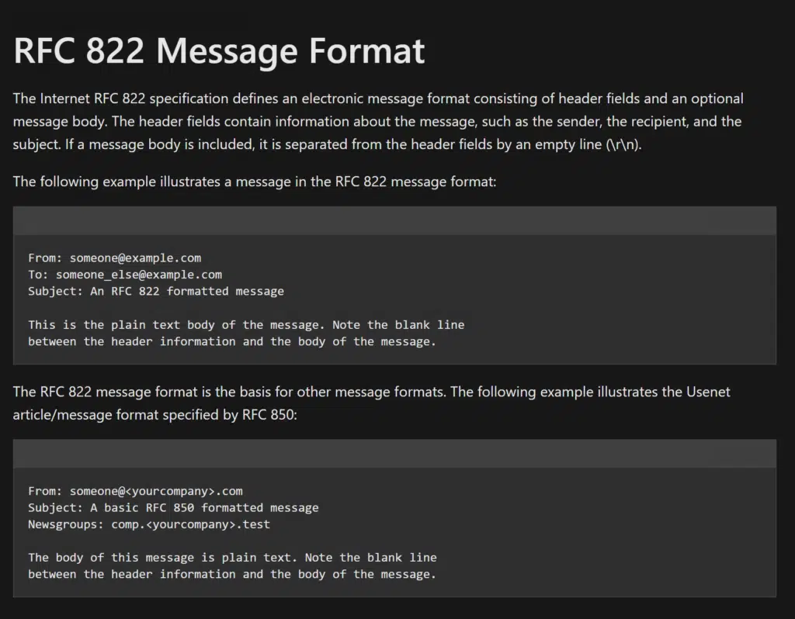
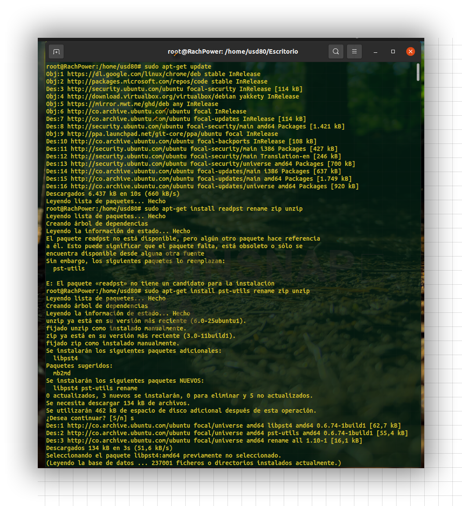
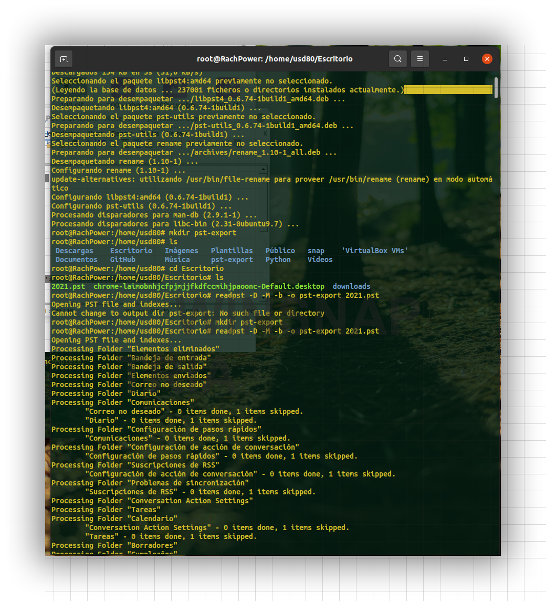
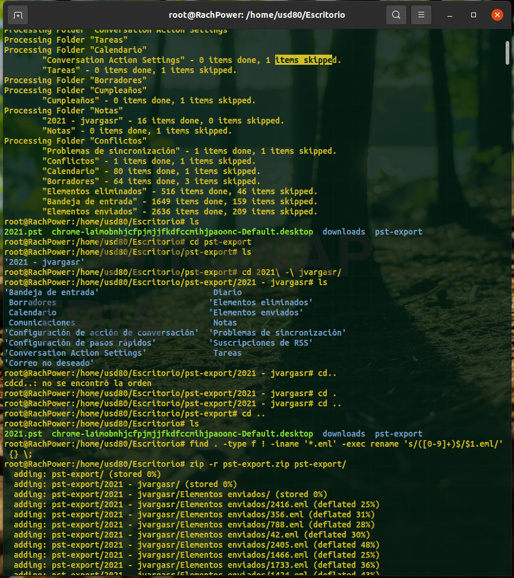
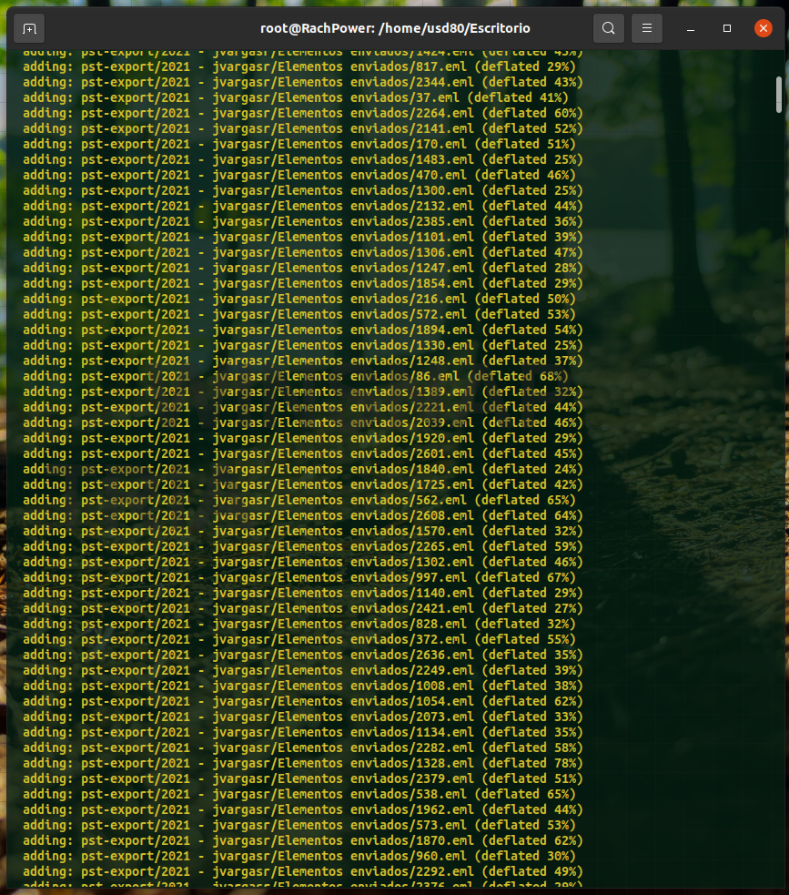

 <h1> PST-a-EML <h1/>


Se realiza la conversión en la terminal Linux Ubuntu v.2022.1 de los formatos de correo electrónico de la organización Microsoft, los archivos de datos cuya exención es PST, la cual es conformada por calendarios, bandejas de entrada, bandeja de salida etc,... es exportada al formato standar EML.

----
- Console

```
#sudo apt-get update
#sudo apt-get install readpst rename zip unzip
```
#mkdir pst-export
#readpst -D -M -b -o pst-export archive.pst
```
#ls
#cd pst-export/
#ls
#cd  -Directorio- 
#ls
```
#find . -type f ! -iname '*.eml' -exec rename 's/([0-9]+)$/$1.eml/' {} \;
```
#zip -r pst-export.zip pst-export/
```
#cd -r pst-export.zip /mnt/d/

```
 ----
 
 -RFC
 
 <p align="center">
  
 </p align="center"
----

 <h3> -Descripción <h3/>
  
 ¿Qué es un archivo EML?
  
La extensión de archivo EML es un acrónimo de E-mail y creado por Microsoft Corporation. EML archivos se almacenan los mensajes de correo electrónico en formato de texto sin formato. Se utiliza en Outlook Express de Microsoft salvado mensajes de correo y de parte de los programas de mensajería de correo electrónico de Microsoft. La estructura de archivo EML es estándar y, normalmente, contiene la cabecera y el mensaje o el cuerpo principal. Dirección de correo electrónico del remitente y el receptor que incluye el tema, la hora y la fecha comprende la cabecera del archivo, y el cuerpo se detalla el mensaje mismo. Mensajes de correo electrónico también pueden indicar los archivos adjuntos y otros hipervínculos que el remitente ha pegado en el archivo EML. El cumplimiento de las normas para los encabezados de correo electrónico o también conocido como RFC 822, se permite archivos EML para ser utilizado con diversas aplicaciones, servidores y clientes de correo electrónico. Esto significa que los archivos EML se pueden ver sin restricciones por otros sistemas operativos y diferentes navegadores preferidos por los usuarios.
  <h3>  <h3/> 
 
  
  
 ¿Qué es un archivo PST?
  
PST es la abreviatura de Personal Storage. Un archivo PST es, por tanto, un contenedor de datos personales que debes imaginarte como una mezcla entre una caja fuerte y una carpeta de archivos. En el archivo PST, Outlook recoge los datos personales y sincronizados del usuario y los almacena como copia de seguridad en el ordenador. PST de Outlook es un formato de archivo propietario de Microsoft, es decir, tiene licencia de Microsoft y, por norma general, solo puede abrirse con Outlook y una cuenta de Outlook correspondiente.

El papel que desempeñan los archivos PST para los usuarios depende principalmente del tipo de cuenta de Outlook:

Cuentas deOutlook conPOP (también POP3): los correos se descargan directamente del servidor de correo y se guardan de manera local en el ordenador en formato PST.
Cuentas de Outlook con IMAP, de Outlook 365, de Exchange o de Outlook.com: los “datos originales” permanecen en el servidor de correo, mientras que los archivos de datos offline de Outlook, los archivos OST, se almacenan temporalmente en el dispositivo.
La ventaja del formato PST es su capacidad de almacenamiento en comparación con el volumen de almacenamiento notablemente inferior de los buzones de correo. Desde Office 2010, los archivos PST cuentan con unacapacidad de almacenamiento de 50 GB. Por tanto, el PST te permite:

Usar un archivo PST local para archivar correos electrónicos con Outlook, distinguiendo, p. ej. entre el archivado de mensajes privados y el archivado de mensajes de empresa
Guardar copias de seguridad de diferentes datos personales de usuario de forma local en el ordenador como backup de Outlook
Exportar datos de tu cuenta de Outlook como archivo PST para liberar espacio de almacenamiento en el buzón 
  
  
  
  
  ----
-Imagenes
 
<p align="center">

  
  
  
</p align="center"


----
  
  
  
----
  
usd80 - Jonathan Vargas Roa
